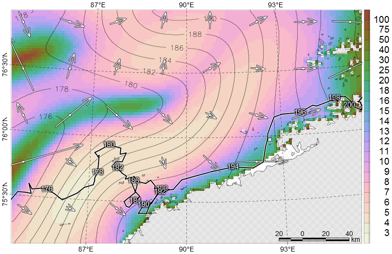

# {.additional}

## Abbreviations

<abbr title="Sea ice concentration">SIC</abbr>...

<abbr title="Sea ice extent">SIE</abbr>...

<abbr title="Sea ice disappearance">SID</abbr> onset dates...

<abbr title="Sea ice appearance">SIA</abbr> onset dates...

<abbr title="Day of the year">DOY</abbr>...

<abbr title="Root mean square error">RMSE</abbr>...

```{r init}
source("../phenology.R",echo=FALSE)
transition <- seasonality()
stage <- as.list(args("cleanse"))
threshold <- paste0(as.list(args("phenology"))$th," %")
```

# Introduction

During last four decades sea ice extent declines, sea ice becomes younger and thinner [@Stroeve2018]. In this issue we focused on earlier sea ice break-up and later sea ice advance.


# Methods

## Sea ice concentration data

Passive microwave sea ice concentration data [@NASATeam_GSFC] is selected for long-term estimating of variability and trends.

## Isotonic regression

Isotonic unimodal regression [@Turner1997] is used for fitting of SIC time-series. Implemented in package `Iso` [@r-Iso] for R statistical software [@r-core]. Isotonic fitted curve excludes double or multiple crossing threshold value, which was reached in 5% cases of fitted smoothed regional SIC time-series [@SternLaidre2016].

:::aside
> In practice, out of 2736 crossing dates (36 years × 2 seasons × 19 regions × 2 time series
per region), only 131 dates (4.8 %) had any potential for ambiguity.
In more than 95 % of the cases there was clearly only a single crossing date.
[@SternLaidre2016]
:::

Less sensitive for period subset in comparison with asymmetrical Gaussian

## Seasons

Overlapped periods (Figure \@ref(fig:transitions)).

+ "max": winter, period of maximal sea ice extent between `r format(transition$max$from,"%d %B")` and `r format(transition$max$to,"%d %B")`.

+ "mlt": Spring, period of sea ice retreat between `r format(transition$mlt$from,"%d %B")` and `r format(transition$mlt$to,"%d %B")`.

+ "min": Summer, perod of minimal sea ice extent between `r format(transition$min$from,"%d %B")` and `r format(transition$min$to,"%d %B")`.

+ "frz": Autumn, period of sea ice advance between `r format(transition$frz$from,"%d %B")` and `r format(transition$frz$to,"%d %B")`.

```{verbatim, echo=F}
   period <- list(mlt=list(from=as.Date(paste0(year,"-02-15"))
                          ,to=as.Date(paste0(year,"-09-30")))
                 ,frz=list(from=as.Date(paste0(year,"-08-15"))
                          ,to=as.Date(paste0(year+1L,"-03-31"))
                          )
                 ,min=list(from=as.Date(paste0(year,"-07-15"))
                          ,to=as.Date(paste0(year,"-10-31"))
                          )
                 ,max=list(from=as.Date(paste0(year+shift,"-01-15"))
                          ,to=as.Date(paste0(year+shift,"-05-15"))
                          )
                  )[transition]
```

Seasonal sequence for SID is "max", "mlt", "min".

Seasonal sequence for SIA is "min", "frz", "max". 

```{r transitions, fig.cap="Temporal relationships between the seasons and the SIA and SID analysis periods"}
knitr::include_graphics("assets/transitions.png",dpi=300)
```

## SIC threshold

We selected SIC `r threshold`, which is abopted from @Parkinson1999. This is common value for estimating sea ice extent [@NSIDC_ice-extent].

## Short-terms states

Comparing summer minimal extent and extent of resident sea ice, we estimated `r stage$summer` as a minimal duration for open-water period during summer.
Comparing winter maximal extent and outer extent without resident open water, we estimated `r stage$winter` as a minimal duration for sea ice period during winter.
If SIC is <`r threshold` for fitted timeseries during `r stage$summer` days or more, then SID and SIA are detected.
If SIC is <`r threshold` for fitted time-series during less than `r stage$summer` days, then resident ice is detected.
If SIC is ≥`r threshold` for fitted timeseries during `r stage$winter` days or more, then SID and SIA are detected.
If SIC is ≥`r threshold` for fitted time-series during less than`r stage$winter` days, then resident open water is detected.

## SIC preprocessing

Spatial (focal) and temporal filling data gaps. 

> *2013*: We developed an algorithm to estimate SID and SIA onset dates using daily SIC data derived from 25-km x 25-km pixel resolution SSM/I and SSMIS passive microwave satellite imagery (Maslanik et al. 1999). We preprocessed the SIC data in two steps:  1) spatial filtering to fill no-data pixels using Gaussian smoothing with a 3x3 pixel window size and $\sigma$=0.75; and 2) temporal linear interpolation to fill remaining no-data pixels using three sequential sliding windows with sizes 3x3, 5x5, and 7x7 pixels.

:::aside

>> "Maslanik et al. 1999" is @NASATeam_NRT. Change to [@NASATeam_GSFC].   
   + GSFC NASA Team [@NASATeam_GSFC]  
   + GSFC Bootstrap [@Bootstrap_GSFC_v3]  
   + NRT NASA Team [@NASATeam_NRT]
:::

Invisible for SSM/I and SSMIS scanning instrument Polar belt (approximately north of 86.5°N) is filled by SIC value 100%. For our data () There is no SID or SIA onsets, which are close to polar belt for our data (1988-2021). Each map contains 66285 cells. Coastal buffer zone (1-2 pixel or 25-50 km) are (can be) applied for output.

## Algorithm

Each phenological state (SID or SIA) is considered independently. For each phenological state seasons are considered independently: "max", "mlt", and "min" for SID; "min", "frz", and "max" for SIA. For each season, SIC time-series is approximated by isotonic function with a single mode. Based on fitted time-series, SID is last date when SIC ≥`r threshold`, SIA is first date when SIC ≥`r threshold`.

### Inverting

Generally, two time-series: original $x$ and inverted $100-x$ are fitted. For "max" season only original $x$ is considered. For "min" season only inverted $100-x$ is considered. For "mlt" and "frz" seasons both fittings compete, and fitting with minimal RMSE is selected. Backward transition $100-x$ is applied for inverted fitting.

### Onset quality

Additional numeric value for onset quality, proximity to ends of time-series, is included to interim output for estimating quality of fitting. Proximity to ends is estimated as a fraction between 0.0 and 0.5, where 0.0 means position in the head or tail of time-series, 0.5 means position in the middle of time-series. There is more uncertainty in the proximity to the boundaries of time-series period because of the uncertain time-series behavior beyond considered period.

## Decision making

Because output has length 3, only one value is selected based on maximal value of onset quality.

:::aside
Deprecated:

> For SID "mlt" has higher priority. For SIA "frz" has higher priority. If SIA, then "max" is selected between "min" and "max" competition. 
:::


## Output

Raster maps with two kinds of information.

1. Values between 15 and 600 denote DOY of SID onset or SIA onset.

1. Values greater than 600 are flags.

   + 990: resident sea ice  
   + 980: resident open water 
   + 930: transition  
   
      Below are interim flags for flexible detection of short-term phenological stages:  
      
      + 701-750: lifetime of short-term ice during winter in days with added value 700  
      + 701-750: lifetime of short-term open water during summer in days with added value 800  
      
      After excluding of short-term phenological stages (`r stage$winter` days for sea ice and `r stage$summer` days for open water), values between 701 and `r stage$winter-1+700` are reclassified to 980, values between `r stage$winter+700` and 750 are reclassified to 930, values between 801 and `r stage$summer-1+800` are reclassified to 990, values between `r stage$summer+800` and 850 are reclassified to 930.
      
   <!--
      + 850: algorithm fails to detect transition from open water to sea ice
      + 840: short-term sea ice (duration of period with ice is less than `slen` days)
      + 830: short-term open water (duration of period without ice is less than `slen` days)  
      + 820: sometimes SIC drops <`r threshold` but fitting doesn't drops this threshold  
      + 810: sometimes SIC raises ≥`r threshold` but fitting doesn't raises this threshold  
      
      Flags 880, 830, and 820 are interpreted as resident ice.
   -->

1. Values greater than 6500 are dates with origin `r format(ursa:::.origin(),"%Y-%m-%d %H:%M:%S")`.

## Quality assessment

We developed two kind of maps for consequent interleaving.

+ Difference between SIA dates and SID dates -- length of open water season

+ Difference between SID dates and SIA dates -- length of ice season


# Mapping

Output example is illustrated on Figure \@ref(fig:onsets).

```{r onsets, fig.cap="Consequence of phenological seasons"}
knitr::include_graphics("assets/onsets.png",dpi=48)
```

## Comparison with 


+ Using ‘nugget’ (variogram parameter), spatial autocorrelation

   + SID *vs* first/second/third day when SIC drops below `r threshold`.

   + SID *vs* date when "At least three consequent days with SIC<`r threshold`". 

+ Difference in days between snowmelt onset and SID.

# Application

## Data compression

For any date (in units of DOY) of transitional period SIE is restored by overlapping mask with values ≤DOY and mask with flag of resident ice.

Single map instead of seasonal set (about three hundred maps) of sea ice extent maps. See comparison on Figure \@ref(fig:cumextent). Tails of isotonic SID and SIA curvesare limited by minimal and maximal values of onset.

```{r cumextent, fig.cap="Evolutions of SIE (grey) from SIC and restored SIE from SID (red) and SIA (blue) maps"}
knitr::include_graphics("assets/cumextent.png",dpi=250)
```

## Polar bears behaviour

+ As a metric for polar bear habitat.

+ Polar bear subpopulation choropleths. 

+ Scatterplot (Figure \@ref(fig:telemetry)), X-value is date of polar bear location, Y-value is SID/SIA.

```{r telemetry, fig.cap="How to polar bear adapt to sea ice break-up"}
knitr::include_graphics("assets/telemetry.png",dpi=300)
```
:::note
Figure \@ref(fig:telemetry) is apopted from @Rozhnov2017_hutuda. Would be better to use permitted data, like @Pagano2021_CRW.
:::

## Isodates

This is mapping too (Figure \@ref(fig:inversedem)).

+ Direction of SID/SIA

+ Speed of SID/SIA (km day^-1^).

+ Contour lines, where units are dates or DOY.

```{r inversedem, fig.cap="Extracted parameters from SID map"}

```

## Snow freeze onset 

Early freeze onset and freeze onset estimates [@Markus_PMW_data] based on passive microwave data [@Markus2009_PMW]. Similar to MDSDA [@Belchansky2004_RSE; @Rigor2000].

+ Current state: PMW freeze onset verification by SIA dates.

+ Proposed state: Masking of seasonal and resident ice. Freeze onset makes sense only for resident ice, whereas SIA can be used for seasonal ice.

# Discussion

## "Resident ice" term

We used "resident" ice instead of summer minimum. 

## Monitoring tasks

Near real-time data for monitoring tasks. For mapping "near" means couple weeks for regions with seasonal ice and months for regions with close proximity to MYI

+ SIC in 25 km grid [@NASATeam_NRT].
   
+ SIC in 6.25 km grid [@Bremen_iceconc; @Bremen_ASI5].

Time-series of ice-charts (e.g., @USNIC_MIZ, [Norwegian](https://cryo.met.no/en/ice-charts-client)^[TODO bibliography citation] and [American](https://www.weather.gov/afc/ice)^[TODO bibliography citation] ice charts) can be applied too BUT with additional expert conversion quantitative data (ice type, category of ice fraction) to qualitative data (ice concentration)


# {.additional}


## Conflicts of interest/Competing interests

The authors declare no conflict of interest.

## Availability of data and material

+ Any stage: github R [@r-core] repository, including GeoTiff/NetCDF dataset, with Zenodo DOI. CRAN package.

+ After publication: add publication citing to package's "how to cite".

+ NSIDC dataset?

## Authors' contributions

NP: Locomotivation

DD: Clarification


## Consent for publication

I would like to declare on behalf of my co‐authors that the work described was original research that has not been published previously, and not under consideration for publication elsewhere, in whole or in part. The manuscript is approved by all authors for publication.

## Funding

NP:

DD:

:::{id="refs"}
:::
